# Tic Tac Toe with AI and Database Tracking

## Overview
This project implements a complete Tic Tac Toe game with intelligent AI opponents and comprehensive game history tracking. The application features a Qt-based GUI, multiple difficulty levels for AI opponents, multiplayer support, player statistics tracking, and game replay functionality.

## Key Features

### 🧠 AI Opponent System
- **Minimax Algorithm** with alpha-beta pruning
- **Two Difficulty Levels**:
  - **Easy**: 3-ply depth search with basic win detection
  - **Hard**: Full-depth search with positional evaluation heuristics
- **Position Evaluation**:
  - Immediate win detection (+10)
  - Blocking opponent wins (-10)
  - Center and corner control bonuses

### 💾 Database Integration
- **SQLite Database** for persistent storage
- **Player Statistics Tracking**:
  - Wins, losses, and draws
  - Historical performance analysis
- **Game History**:
  - Complete board state storage
  - Move-by-move replay functionality
- **Secure Authentication**:
  - SHA-256 password hashing
  - Parameterized queries to prevent SQL injection

### 🎮 Game Features
- Single-player vs AI mode
- Two-player local multiplayer
- Player customization (X/O selection)
- Interactive game replay system
- Win/draw detection and celebration

Game architecture :

```mermaid
graph LR
    subgraph Layers
        P[Presentation Layer<br>Qt UI]
        A[Application Layer<br>Controller]
        D[Domain Layer<br>Game Logic]
        AI[AI Engine]
        DB[Data Layer<br>Database]
    end
    
    P <-->|User Events| A
    A <-->|State Updates| D
    D <-->|AI Requests| AI
    D -->|Save Data| DB
    DB -->|Load Data| D
    
    subgraph Presentation Details
        P1[Login/Signup]
        P2[Game Screens]
        P3[Game Board]
        P4[History View]
    end
    
    subgraph Application Details
        A1[Event Handling]
        A2[Screen Management]
        A3[Game Flow]
    end
    
    subgraph Domain Details
        D1[Board State]
        D2[Game Rules]
        D3[Player Management]
    end
    
    subgraph AI Details
        AI1[Minimax]
        AI2[Alpha-Beta]
        AI3[Evaluation]
    end
    
    subgraph Data Details
        DB1[Player Stats]
        DB2[Game History]
        DB3[Replays]
    end
    
    P --> P1 & P2 & P3 & P4
    A --> A1 & A2 & A3
    D --> D1 & D2 & D3
    AI --> AI1 & AI2 & AI3
    DB --> DB1 & DB2 & DB3
```



## Architecture Flow


## Component Relationships

| Layer | Components | Responsibilities |
|-------|------------|------------------|
| **Presentation** | Login UI<br>Game Screens<br>Board UI<br>History View | User interface rendering<br>Input collection<br>Visual feedback |
| **Application** | Event Handler<br>Screen Manager<br>Game Flow | Input processing<br>Screen transitions<br>Turn management |
| **Domain** | Board State<br>Game Rules<br>Player Manager | State management<br>Win/draw detection<br>Player switching |
| **AI** | Minimax<br>Alpha-Beta<br>Evaluator | Move calculation<br>Position analysis<br>Strategy selection |
| **Data** | Player Stats<br>Game History<br>Replay System | Statistics tracking<br>Game persistence<br>Move replay |

## Technical Implementation

### AI Decision-Making Process
```cpp
Move TicTacToe::findBestMove(vector<vector<unsigned char>>& board, unsigned char state_2) {
    int bestScore = INT_MIN;
    Move bestMove = {-1, -1};
    
    for (int i = 0; i < BOARD_SIZE; ++i) {
        for (int j = 0; j < BOARD_SIZE; ++j) {
            if (board[i][j] == EMPTY_CELL) {
                board[i][j] = state_2;  // Try move
                int score = minimax(board, RemPlays - 1, false, INT_MIN, INT_MAX, state_2);
                board[i][j] = EMPTY_CELL;  // Undo move
                
                if (score > bestScore) {  // Track best move
                    bestScore = score;
                    bestMove = {i, j};
                }
            }
        }
    }
    return bestMove;
}
```

### Database Schema
```sql
CREATE TABLE Players (
    id INTEGER PRIMARY KEY AUTOINCREMENT,
    username TEXT NOT NULL UNIQUE,
    password TEXT NOT NULL
);

CREATE TABLE game_history (
    id INTEGER PRIMARY KEY AUTOINCREMENT,
    username TEXT NOT NULL,
    game_data TEXT NOT NULL,
    replay TEXT NOT NULL,
    wins INTEGER DEFAULT 0,
    losses INTEGER DEFAULT 0,
    ties INTEGER DEFAULT 0,
    timestamp DATETIME DEFAULT CURRENT_TIMESTAMP
);
```

### Database Security
```cpp
// Password hashing example
QByteArray hashedPassword = QCryptographicHash::hash(
    password.toUtf8(), 
    QCryptographicHash::Sha256
);

// Secure query execution
QSqlQuery query;
query.prepare("INSERT INTO Players (username, password) VALUES (:user, :pass)");
query.bindValue(":user", username);
query.bindValue(":pass", hashedPassword.toHex());
query.exec();
```

## Installation & Setup

### Prerequisites
- Qt 5.15+
- C++17 compatible compiler
- SQLite3

### Build Instructions
```bash
# Clone repository
git clone https://github.com/yourusername/tictactoe-ai.git
cd tictactoe-ai

# Create build directory
mkdir build && cd build

# Generate build files
qmake ..

# Build project
make -j4

# Run application
./TicTacToe
```

### Database Initialization
The application will automatically create the database file (`TicTacToe.db`) on first run in the application directory.

## Usage Guide

### Game Modes
1. **Single Player**:
   - Choose difficulty (Easy/Hard)
   - Select X or O symbol
   - Play against AI opponent

2. **Multiplayer**:
   - Two players share the same device
   - Players take turns as X and O
   - Game history saved for both players

### Features
- **Game History**: View past games from main menu
- **Replay System**: Watch previous games move-by-move
- **Statistics**: Track win/loss/draw ratios
- **Account System**: Secure login with password hashing

## Technical Highlights

### AI Optimization
- Alpha-Beta Pruning: Reduces search space by 30-50%
- Move Ordering: Evaluates center positions first
- Terminal State Detection: Immediate return on win/loss
- Symmetry Reduction: Avoids duplicate position evaluations

## Future Enhancements
- [ ] Online multiplayer support
- [ ] Cloud-based game synchronization
- [ ] Machine learning-based AI training
- [ ] Mobile app port (Android/iOS)
- [ ] Tournament mode with leaderboards
